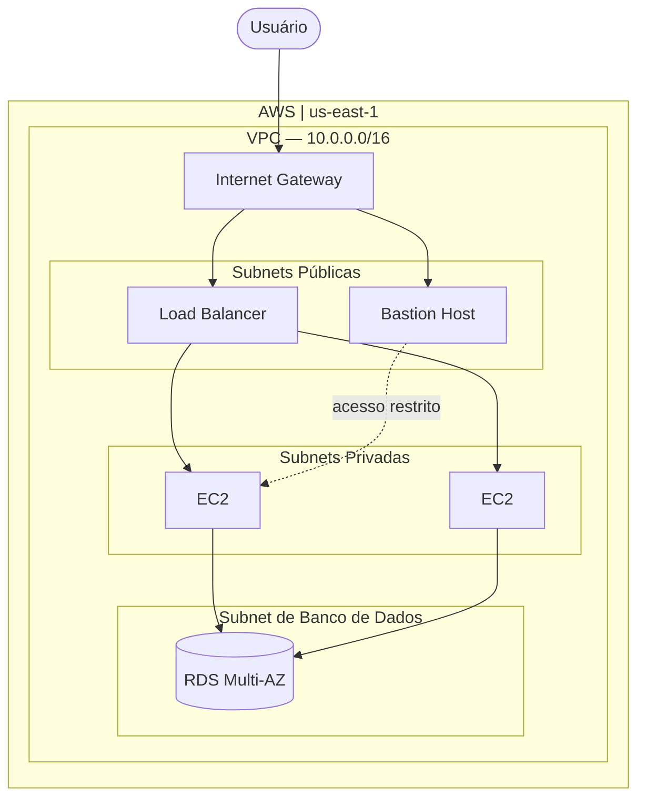

# Primeiros passos Terraform

Um guia de estudos para aprender Terraform do zero com foco no que realmente importa. Cada fase cobre um conceito fundamental, tem um exercício prático e um critério claro de conclusão. Ao final, você terá um projeto real funcionando: uma arquitetura VPC na AWS estruturada para produção.

---

## Documentação

A documentação é o ponto de partida. Lá estão o roadmap completo, a teoria de cada fase e os guias dos exercícios. Comece por ela antes de escrever qualquer código.

**[Acessar a documentação](https://rhuancsg.github.io/terraform-primeiros-passos/)**

---

## Para quem é

Para quem está começando com Terraform e quer aprender de forma estruturada. Não é necessário ter experiência prévia com IaC, mas conhecimento básico de terminal e familiaridade com os conceitos fundamentais da AWS são necessários.

**Pré-requisitos:**

- Conta AWS com AWS CLI configurado
- Docker instalado e rodando
- Python com pip
- Git

---

## Estrutura do Repositório

```
terraform/
│
├── docs/                   # Teoria, roadmap e guias de cada fase
│   ├── roadmap.md
│   ├── fase-0-setup/
│   ├── fase-1-fundamentos/
│   ├── fase-2-state/
│   ├── fase-3-variaveis/
│   ├── fase-4-modulos/
│   └── fase-5-producao/
│
├── src/                    # Código Terraform construído fase a fase
│
└── scripts/                # Setup de ambiente e limpeza de recursos
```

O `src/` começa vazio. O código é criado ao longo das fases e o histórico do git registra a evolução.

---

## Projeto Final

O projeto central do guia é uma arquitetura VPC segura e escalável na AWS, com separação de responsabilidades em três camadas: pública, privada e de banco de dados. O acesso administrativo é feito exclusivamente via bastion host, o tráfego de aplicação é distribuído pelo load balancer entre instâncias em múltiplas zonas de disponibilidade, e o banco de dados fica em uma subnet isolada, inacessível diretamente da internet.


