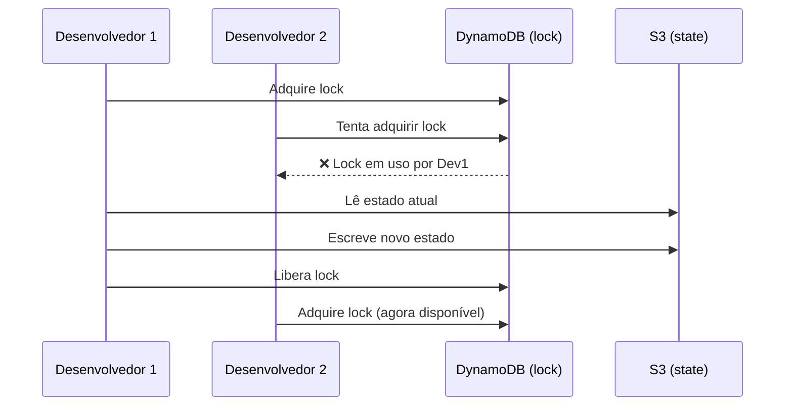

# Estado Remoto

O estado remoto resolve os problemas do estado local: um único lugar centralizado, acessível por qualquer membro do time, com proteção contra execuções simultâneas.

---

## A Solução: Backend S3 + DynamoDB

O padrão mais comum no mercado AWS usa:
- **S3** → armazenamento do arquivo de estado (durável, versionado, criptografado)
- **DynamoDB** → state locking (impede dois `apply` simultâneos)



---

## Configurando o Backend

### Passo 1: Criar o bucket S3 e a tabela DynamoDB

Esses recursos devem existir **antes** de configurar o backend. Uma prática comum é tê-los em um diretório separado chamado `bootstrap/` ou `state-backend/`:

```hcl
# bootstrap/main.tf

resource "aws_s3_bucket" "terraform_state" {
  bucket = "meu-projeto-terraform-state"
}

resource "aws_s3_bucket_versioning" "state_versioning" {
  bucket = aws_s3_bucket.terraform_state.id

  versioning_configuration {
    status = "Enabled"  # ← crucial: permite recuperar versões anteriores do estado
  }
}

resource "aws_s3_bucket_server_side_encryption_configuration" "state_encryption" {
  bucket = aws_s3_bucket.terraform_state.id

  rule {
    apply_server_side_encryption_by_default {
      sse_algorithm = "AES256"  # ← criptografia em repouso
    }
  }
}

resource "aws_dynamodb_table" "terraform_locks" {
  name         = "meu-projeto-terraform-locks"
  billing_mode = "PAY_PER_REQUEST"
  hash_key     = "LockID"

  attribute {
    name = "LockID"
    type = "S"
  }
}
```

### Passo 2: Configurar o backend no projeto

```hcl
# main.tf (ou backend.tf)

terraform {
  backend "s3" {
    bucket         = "meu-projeto-terraform-state"
    key            = "fase-2/terraform.tfstate"  # caminho dentro do bucket
    region         = "us-east-1"
    dynamodb_table = "meu-projeto-terraform-locks"
    encrypt        = true
  }
}
```

### Passo 3: Migrar o estado local

```bash
terraform init
```

O Terraform detecta a mudança de backend e pergunta:

```
Initializing the backend...

Do you want to copy existing state to the new backend?
  Pre-existing state was found while migrating the previous "local" backend to the
  newly configured "s3" backend. Would you like to copy this existing state?

  Enter a value: yes
```

Digite `yes` e o estado é migrado automaticamente para o S3.

---

## Verificando o Estado no S3

=== "Linux / macOS"
    ```bash
    aws --endpoint-url=http://localhost:4566 \
        --profile localstack \
        s3 ls s3://meu-projeto-terraform-state/fase-2/

    # Você deve ver:
    # 2024-01-15 10:30:00    1234 terraform.tfstate
    ```

=== "PowerShell"
    ```powershell
    aws --endpoint-url=http://localhost:4566 `
        --profile localstack `
        s3 ls s3://meu-projeto-terraform-state/fase-2/

    # Você deve ver:
    # 2024-01-15 10:30:00    1234 terraform.tfstate
    ```

---

## O que acontece com o State Lock?

Quando você roda `terraform apply`, o Terraform:

1. Verifica se há um lock na tabela DynamoDB
2. Se livre, cria um registro com seu ID de lock
3. Executa o apply
4. Remove o registro da tabela

Se outro `apply` tentar rodar enquanto o lock está ativo:

```
Error: Error locking state: Error acquiring the state lock: ConditionalCheckFailedException

  Lock Info:
    ID:        8a3c4d2e-...
    Path:      meu-projeto-terraform-state/fase-2/terraform.tfstate
    Operation: OperationTypeApply
    Who:       user@hostname
    Created:   2024-01-15 10:30:00
```

**Removendo um lock travado** (use apenas se tiver certeza que ninguém está aplicando):
```bash
terraform force-unlock <LOCK_ID>
```

---

## Partial Configuration (variáveis no backend)

O bloco `backend` não aceita variáveis do Terraform. Para evitar repetição entre ambientes, use **partial configuration**:

```hcl
# backend.tf — deixe os valores em branco
terraform {
  backend "s3" {}
}
```

=== "Linux / macOS"
    ```bash
    terraform init \
      -backend-config="bucket=meu-projeto-terraform-state" \
      -backend-config="key=prod/terraform.tfstate" \
      -backend-config="region=us-east-1" \
      -backend-config="dynamodb_table=meu-projeto-terraform-locks"
    ```

=== "PowerShell"
    ```powershell
    terraform init `
      -backend-config="bucket=meu-projeto-terraform-state" `
      -backend-config="key=prod/terraform.tfstate" `
      -backend-config="region=us-east-1" `
      -backend-config="dynamodb_table=meu-projeto-terraform-locks"
    ```

---

## Boas Práticas para o Backend

| Prática | Por quê |
|---|---|
| Versionamento no bucket S3 | Recuperar estado de versões anteriores se houver corrupção |
| Criptografia no bucket S3 | Estado pode conter dados sensíveis |
| Bloquear acesso público ao bucket | Nunca expor o estado publicamente |
| Key única por ambiente | `dev/terraform.tfstate` e `prod/terraform.tfstate` separados |
| Separar a criação do backend (bootstrap) | O backend não pode criar a si mesmo |

---

## Próximo

➡️ [Fase 3 — Variáveis, Outputs e Locals](../fase-3-variaveis/index.md)
