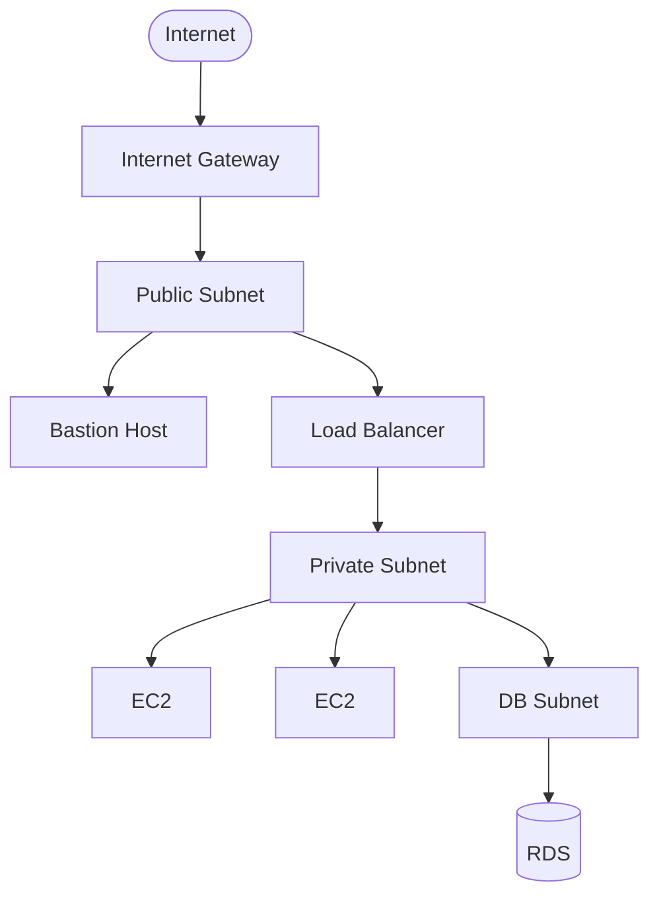

# Primeiros passos Terraform

Bem-vindo ao seu repositório de aprendizado de Terraform. Este guia foi construído para levar você do **zero absoluto** ao nível de um engenheiro de infraestrutura profissional.

## O que você vai aprender

Ao final desta jornada, você será capaz de:

- Escrever código HCL limpo, reutilizável e bem estruturado
- Gerenciar estado de infraestrutura com segurança (incluindo estado remoto)
- Criar e consumir módulos Terraform — seus próprios e os do Registry público
- Estruturar repositórios para múltiplos ambientes (dev/prod)
- Aplicar boas práticas de segurança em projetos reais

## Projeto Prático

O fio condutor de toda a jornada é uma **Arquitetura VPC Segura na AWS**, construída tijolo a tijolo em cada fase:

## Filosofia do Repositório

> **O git history é o seu diário de bordo.** Cada exercício concluído = um commit. Ao final, você terá um registro completo da sua evolução.

- **Fases 1–4:** Usamos [LocalStack](https://localstack.cloud/) para simular AWS localmente — zero custo, zero risco.
- **Fase 5:** Deploy real na sua conta AWS, com todas as boas práticas aplicadas.

## Por onde começar?

👉 Acesse o [Roadmap](roadmap.md) para ver o plano completo.

Depois, vá direto para a [Fase 0 — Setup](fase-0-setup/index.md) para configurar seu ambiente.
