# Roadmap de Estudos — Primeiros passos Terraform

Este roadmap é dividido em 6 fases progressivas. Cada fase tem teoria, exercício prático e um critério claro de conclusão.

---

## Visão Geral

```mermaid
gantt
    title Jornada Primeiros passos Terraform
    dateFormat  X
    axisFormat Fase %s

    section Fundação
    Fase 0 - Setup           :0, 1
    Fase 1 - Fundamentos HCL :1, 2

    section Intermediário
    Fase 2 - Estado          :2, 3
    Fase 3 - Variáveis       :3, 4

    section Avançado
    Fase 4 - Módulos         :4, 5
    Fase 5 - Produção        :5, 6
```

---

## 0. Setup e Ambiente

**Objetivo:** Ter o ambiente completamente configurado e entender o fluxo de trabalho IaC antes de escrever uma linha de código.

**Ambiente:** Local (sem cloud)

- [ ] Instalação do Terraform e verificação de versão
- [ ] Instalação do Docker e LocalStack
- [ ] Instalação e configuração do `tflocal` (wrapper para LocalStack)
- [ ] Configuração do AWS CLI com perfil `localstack`
- [ ] Inicialização do repositório Git
- [ ] Revisão do `.gitignore` e entendimento do que NUNCA commitar

**Critério de conclusão:** `tflocal version` retorna a versão do Terraform; LocalStack está rodando e acessível em `localhost:4566`.

---

## 1. Fundamentos HCL e Ciclo de Vida

**Objetivo:** Entender a sintaxe da linguagem, como funciona um provider e executar o ciclo completo init → plan → apply → destroy.

**Ambiente:** LocalStack

- [ ] [Sintaxe HCL](fase-1-fundamentos/hcl-syntax.md): blocks, arguments, expressions, tipos de dados
- [ ] [Providers](fase-1-fundamentos/providers.md): o que são, como configurar o AWS Provider
- [ ] [Ciclo de vida](fase-1-fundamentos/lifecycle.md): `init`, `plan`, `apply`, `destroy` — o que cada um faz
- [ ] Recursos (`resource`) e fontes de dados (`data`)

**Exercício:** Criar um S3 bucket no LocalStack do zero — arquivo `main.tf` escrito linha a linha.

**Critério de conclusão:** `tflocal apply` cria o bucket sem erros; `tflocal destroy` remove tudo limpo.

---

## 2. Gestão de Estado

**Objetivo:** Entender o papel central do arquivo de estado e aprender a gerenciá-lo com segurança.

**Ambiente:** LocalStack

- [ ] [Estado local](fase-2-state/local-state.md): o que é o `terraform.tfstate`, o que ele contém e por que é crítico
- [ ] [Estado remoto](fase-2-state/remote-state.md): backend S3 + DynamoDB para state locking
- [ ] Comandos de inspeção: `state list`, `state show`
- [ ] Comandos de manipulação: `state mv`, `state rm` (e quando NÃO usar)

**Exercício:** Migrar o estado local do exercício da Fase 1 para um backend S3 no LocalStack.

**Critério de conclusão:** O arquivo `terraform.tfstate` local não existe mais; o estado está no S3 e protegido por lock no DynamoDB.

---

## 3. Variáveis, Outputs e Locals

**Objetivo:** Escrever código parametrizável, reutilizável e sem repetição.

**Ambiente:** LocalStack

- [ ] [Variables](fase-3-variaveis/variables.md): tipos, validações, defaults, `terraform.tfvars`
- [ ] [Outputs](fase-3-variaveis/outputs.md): expor dados para uso externo e entre módulos
- [ ] [Locals](fase-3-variaveis/locals.md): calcular valores reutilizáveis sem expô-los como variáveis
- [ ] Funções built-in essenciais: `length`, `toset`, `merge`, `lookup`, `format`

**Exercício:** Refatorar o código da Fase 1 para usar variáveis e outputs — sem alterar a infraestrutura criada.

**Critério de conclusão:** `tflocal plan` retorna "No changes" após a refatoração; o código aceita região e nome do bucket como parâmetros.

---

## 4. Módulos

**Objetivo:** Entender a principal abstração de reutilização do Terraform e criar seu primeiro módulo.

**Ambiente:** LocalStack

- [ ] [Criando módulos](fase-4-modulos/criando-modulos.md): anatomia de um módulo, interfaces de entrada/saída
- [ ] Módulos locais vs. [Terraform Registry](fase-4-modulos/registry.md)
- [ ] Passagem de variáveis entre módulo raiz e módulos filhos
- [ ] Versionamento de módulos com `source` e `version`

**Exercício:** Extrair a configuração de VPC para um módulo `modules/vpc/` reutilizável e consumi-lo no `main.tf` raiz.

**Critério de conclusão:** Dois ambientes diferentes (dev/prod) usam o mesmo módulo VPC com configurações distintas.

---

## 5. Produção e Boas Práticas

**Objetivo:** Aplicar tudo que foi aprendido em uma infraestrutura real, seguindo padrões profissionais de mercado.

**Ambiente:** AWS Real (sua conta)

- [ ] [Workspaces](fase-5-producao/workspaces.md): gerenciamento de ambientes dev/staging/prod
- [ ] Ferramentas de qualidade: `terraform fmt`, `terraform validate`, `tflint`, `checkov`
- [ ] [Segurança](fase-5-producao/security.md): gestão de segredos, IAM mínimo, nunca hardcodar credenciais
- [ ] [Estrutura profissional](fase-5-producao/estrutura-pastas.md): como grandes equipes organizam repositórios Terraform

**Exercício (Projeto Final):** Arquitetura VPC completa na AWS real:
- VPC com subnets públicas e privadas em múltiplas AZs
- Bastion Host para acesso SSH seguro
- Auto Scaling Group com EC2 atrás de um ALB
- RDS em subnet privada
- Security Groups com regras de least privilege

**Critério de conclusão:** `terraform apply` no ambiente `prod` cria toda a infraestrutura; `checkov` não reporta falhas críticas de segurança.

---

## Próximos Passos

Após completar as 5 fases, você estará pronto para explorar:

- **Terraform Cloud / HCP Terraform** — gestão de estado e pipelines gerenciados
- **Atlantis** — GitOps para Terraform (PR-driven infrastructure)
- **CI/CD com Terraform** — GitHub Actions, Azure DevOps
- **Terragrunt** — wrapper para DRY em repositórios multi-ambiente
- **CDK for Terraform (CDKTF)** — escrever IaC em TypeScript/Python
